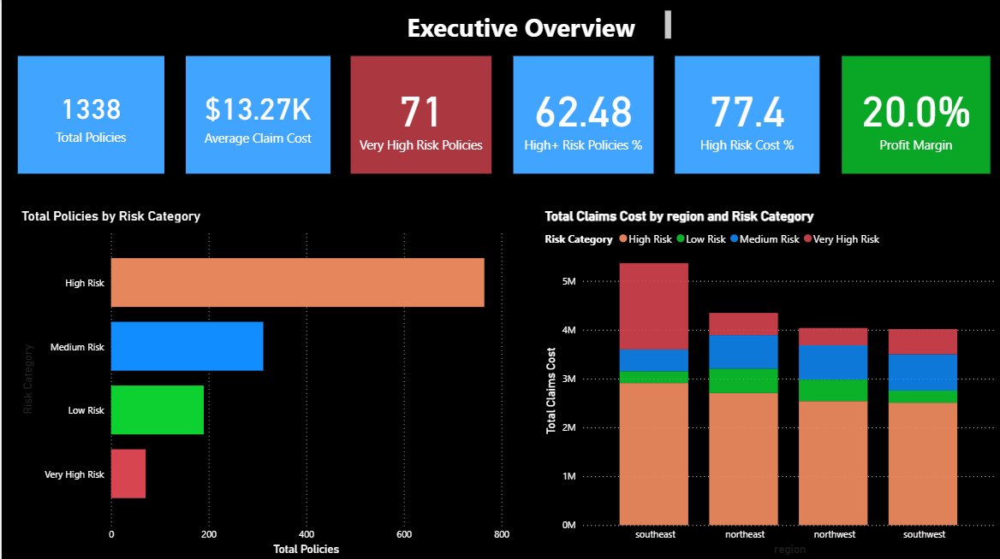
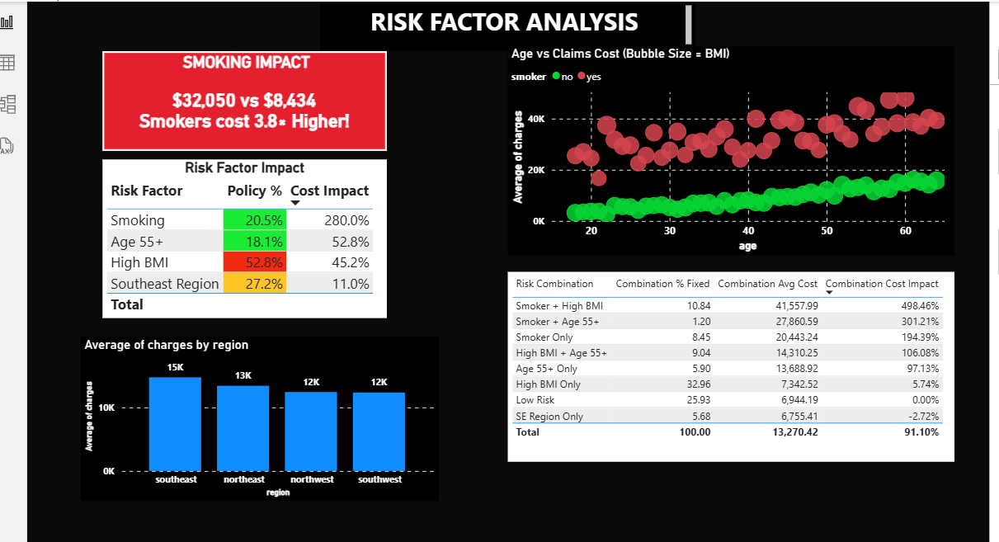

# 📊 US Insurance Portfolio Analytics Dashboard

> A comprehensive Power BI dashboard analyzing 1,338 insurance policies with focus on risk segmentation, cost drivers, and profitability optimization

## 🎯 Project Overview

This Power BI dashboard provides strategic insights into insurance portfolio performance, identifying critical risk factors that drive claims costs and enabling data-driven underwriting decisions. The analysis reveals that **smokers cost 3.8x more** than non-smokers and specific risk combinations drive up to **498% higher claims costs**.

### Business Problem
Insurance companies need to:
- Identify high-cost policy segments for premium optimization
- Understand which risk factors drive claims expenses
- Balance portfolio risk distribution with profitability
- Make evidence-based underwriting decisions

### Solution
A two-page interactive dashboard that:
1. **Executive Overview**: Provides 30-second snapshot of portfolio health, risk distribution, and profitability
2. **Risk Factor Analysis**: Deep-dives into cost drivers (smoking, BMI, age) and their combined impact

---

## 📸 Dashboard Screenshots

### Page 1: Executive Overview


**Key Metrics at a Glance:**
- 📋 **1,338 Total Policies** - Current portfolio size
- 💰 **$13.27K Average Claim Cost** - Baseline claims expense
- ⚠️ **71 Very High Risk Policies** - Critical segment requiring attention
- 📊 **62.48% High+ Risk Policies** - Portfolio concentration metric
- 💹 **20% Profit Margin** - Overall profitability indicator
- 🎯 **77.4% High Risk Cost %** - Cost concentration in risky segments

**Visualizations:**
- **Total Policies by Risk Category** - Horizontal bar chart showing portfolio distribution
- **Total Claims Cost by Region and Risk Category** - Stacked column chart revealing geographic cost patterns

### Page 2: Risk Factor Analysis


**Critical Findings:**
- 🚬 **Smoking Impact Alert**: $32,050 vs $8,434 - **Smokers cost 3.8x Higher!**
- 📊 **Risk Factor Impact Table**: Quantifies cost impact of each risk factor
- 💹 **Age vs Claims Bubble Chart**: Visualizes correlation with BMI sizing
- 📋 **Risk Combination Analysis**: Shows compound effect of multiple risk factors

---

## 🔍 Key Insights Delivered

### Executive Overview Dashboard

| Metric | Value | Business Implication |
|--------|-------|---------------------|
| **Portfolio Size** | 1,338 policies | Sufficient data for statistical significance |
| **Average Claim Cost** | $13.27K | Baseline for profitability calculations |
| **Very High Risk Policies** | 71 (5.3%) | Immediate attention segment |
| **High+ Risk Distribution** | 62.48% | Potential underwriting concern |
| **Profit Margin** | 20% | Healthy but could be optimized |
| **High Risk Cost %** | 77.4% | Significant cost concentration |
| **Highest Cost Region** | Southeast ($2.9M) | Regional underwriting review needed |

**Strategic Takeaway:** While the 20% profit margin appears healthy, the portfolio shows concentration risk with 62.48% high+ risk policies. The Southeast region requires immediate attention with claims costs reaching $2.9M.

---

### Risk Factor Analysis Dashboard

#### 🚨 Critical Cost Drivers (Ranked by Impact)

**1. SMOKING - Most Critical Factor**
- **Cost Impact**: 280.0%
- **Portfolio Share**: 20.5% of policies
- **Average Claims**: 
  - Smokers: $32,050
  - Non-smokers: $8,434
- **Cost Multiplier**: 3.8x higher
- **Business Impact**: Single most significant underwriting criteria

**2. AGE 55+ - Secondary Factor**
- **Cost Impact**: 52.8%
- **Portfolio Share**: 18.1% of policies
- **Implication**: Aging population drives higher medical costs

**3. HIGH BMI - Tertiary Factor**
- **Cost Impact**: 45.2%
- **Portfolio Share**: 52.8% of policies (concerning!)
- **Note**: Largest segment with moderate individual impact

**4. SOUTHEAST REGION - Geographic Factor**
- **Cost Impact**: 11.0%
- **Portfolio Share**: 27.2% of policies
- **Regional Average**: $12K across all regions
- **Consistency**: Relatively uniform regional costs

---

#### 💥 Risk Combination Analysis - Compound Effects

The most dangerous finding: **risk factors compound exponentially**

| Risk Combination | Policies % | Avg Cost | Cost Impact | Strategic Priority |
|------------------|-----------|----------|-------------|-------------------|
| **Smoker + High BMI** | 10.84% | $41,558 | **498.46%** | 🔴 **CRITICAL** - Reprice immediately |
| **Smoker + Age 55+** | 1.20% | $27,861 | **301.43%** | 🔴 **HIGH** - Strict underwriting |
| **Smoker Only** | 8.45% | $20,443 | **194.39%** | 🟡 **MEDIUM** - Premium adjustment |
| **High BMI + Age 55+** | 9.04% | $14,310 | **106.08%** | 🟡 **MEDIUM** - Monitor closely |
| **Age 55+ Only** | 5.90% | $13,689 | **97.13%** | 🟢 **LOW** - Acceptable risk |
| **High BMI Only** | 32.96% | $7,343 | **5.74%** | 🟢 **LOW** - Baseline segment |
| **Low Risk** | 25.93% | $6,944 | **0.00%** | ✅ **IDEAL** - Target segment |

**Key Finding**: Smoker + High BMI policies cost nearly **5x more** than baseline despite representing only 10.84% of the portfolio. This segment drives almost **50% of excess costs**.

---

#### 📊 Age vs Claims Analysis (Bubble Chart Insights)

The scatter plot reveals clear patterns:
- **Red Clusters (Smokers)**: Consistently higher charges across all age groups
- **Green Baseline (Non-smokers)**: Lower, more predictable cost trajectory
- **Age Correlation**: Charges increase with age, but smoking status is the dominant factor
- **BMI Effect (Bubble Size)**: Larger bubbles at higher charges indicate BMI compounds the risk

**Insight**: Even young smokers (age 20-30) show elevated costs compared to older non-smokers (50-60), proving smoking is the primary cost driver regardless of age.

---

## 💼 Business Recommendations

Based on the data analysis, here are actionable recommendations for management:

### 1. 🎯 Immediate Actions (0-30 Days)

**Repricing Strategy:**
- ✅ Increase premiums for "Smoker + High BMI" segment by 40-50% to reflect 498% cost impact
- ✅ Implement smoking verification protocols (cotinine testing) to prevent misclassification
- ✅ Review Southeast region underwriting standards

**Risk Mitigation:**
- ✅ Flag the 71 Very High Risk policies for claims review
- ✅ Implement stricter underwriting for compound risk factors

### 2. 📈 Medium-Term Strategies (1-6 Months)

**Product Innovation:**
- 🔄 Launch wellness incentive programs with premium discounts for:
  - Smoking cessation participation (reduce 10% of smokers = significant savings)
  - Weight management programs for high BMI customers
  - Annual health checkup compliance
- 🔄 Create "Healthy Living" product line targeting low-risk segment (25.93% of portfolio)

**Portfolio Optimization:**
- 🔄 Set underwriting caps on high-risk combinations (limit Smoker + High BMI to 8% of new business)
- 🔄 Expand marketing in low-risk demographics
- 🔄 Regional strategy: investigate why Southeast has highest costs


## 🛠️ Technical Implementation

### Data Sources
- **Primary Dataset**: US Insurance dataset (1,338 policies)
- **Fields Analyzed**: Age, Sex, BMI, Children, Smoker Status, Region, Charges

```

### Key DAX Measures Created

```dax
// Total Policies Count
Total Policies = COUNTROWS(insurance)

// Average Claim Cost
Average Claim Cost = AVERAGE(insurance[charges])

// Profit Margin Calculation
Profit Margin = 
    DIVIDE(
        [Total Premium Revenue] - [Total Claims Paid],
        [Total Premium Revenue],
        0
    ) * 100

// Risk Category Count
Very High Risk Policies = 
    CALCULATE(
        COUNTROWS(insurance),
        insurance[Risk_Category] = "Very High Risk"
    )

// High+ Risk Percentage
High Risk % = 
    DIVIDE(
        CALCULATE(
            COUNTROWS(insurance),
            insurance[Risk_Category] IN {"High Risk", "Very High Risk"}
        ),
        COUNTROWS(insurance),
        0
    ) * 100

// Smoking Cost Impact
Smoking Impact = 
    VAR SmokerAvg = CALCULATE(AVERAGE(insurance[charges]), insurance[smoker] = "yes")
    VAR NonSmokerAvg = CALCULATE(AVERAGE(insurance[charges]), insurance[smoker] = "no")
    RETURN DIVIDE(SmokerAvg, NonSmokerAvg, 1) - 1

// Regional Claims Total
Regional Claims = 
    SUMX(
        FILTER(insurance, insurance[region] = SELECTEDVALUE(DimRegion[RegionName])),
        insurance[charges]
    )

// Cost Impact by Risk Factor
Cost Impact % = 
    VAR FactorAvg = AVERAGE(insurance[charges])
    VAR BaselineAvg = CALCULATE(AVERAGE(insurance[charges]), insurance[Risk_Category] = "Low Risk")
    RETURN DIVIDE(FactorAvg - BaselineAvg, BaselineAvg, 0) * 100
```

### Visualizations Used

| Visual Type | Purpose | Key Insight |
|-------------|---------|-------------|
| **KPI Cards** | Executive metrics | Quick snapshot of portfolio health |
| **Horizontal Bar Chart** | Risk distribution | Shows policy count by risk category |
| **Stacked Column Chart** | Regional analysis | Reveals cost concentration by geography |
| **Data Table** | Risk factor impact | Quantifies individual factor costs |
| **Scatter Plot (Bubble)** | Correlation analysis | Age vs charges with BMI sizing |
| **Matrix Table** | Combination analysis | Shows compound risk effects |
| **Column Chart** | Regional comparison | Average charges across regions |

---

## 📥 How to Use This Dashboard

### Option 1: Download and Run Locally (Recommended)

**Prerequisites:**
- Windows 10/11 operating system
- [Power BI Desktop](https://powerbi.microsoft.com/desktop/) (Free)
- 4GB RAM minimum

**Steps:**
1. **Download Files**
   ```bash
   git clone https://github.com/samir-khanal/US_Insurance_dashboard.git
   cd US_Insurance_dashboard
   ```

2. **Open in Power BI Desktop**
   - Double-click `insurance.pbix`
   - Or: Open Power BI Desktop → File → Open → Select `insurance.pbix`

3. **Explore Interactivity**
   - Click any visual to filter entire dashboard
   - Use slicers to filter by region, risk category
   - Hover over visuals for detailed tooltips
   - Export data using "..." menu on any visual

### Option 2: View Static Images

If you don't have Power BI Desktop:
- View `dashboard_snapshot.png` for high-resolution screenshots

### Option 3: View Online (Coming Soon)

🔗 **Live Dashboard Link**: [Power BI Service](https://app.powerbi.com) *(Publishing in progress)*

---

## 🎓 Skills Demonstrated

This project showcases proficiency in:

✅ **Business Intelligence**
- Translating business questions into analytical frameworks
- Identifying cost drivers and profitability levers
- Providing actionable recommendations to stakeholders

✅ **Data Analysis**
- Statistical analysis of risk factors
- Correlation and compound effect analysis
- Segmentation and cohort analysis

✅ **Power BI Technical Skills**
- DAX measure creation for complex calculations
- Star schema data modeling
- Interactive dashboard design with drill-through
- Conditional formatting for insights highlighting
- Multiple visualization types for different data stories

✅ **Domain Knowledge**
- Insurance industry metrics (loss ratio, risk categories, claims)
- Actuarial concepts (risk pooling, adverse selection)
- Healthcare cost drivers (smoking, obesity, age)

✅ **Communication**
- Data storytelling with executive summary
- Clear visualization of complex relationships
- Presenting technical findings to non-technical audiences

---

## 📊 Dataset Information

**Source**: US Health Insurance Dataset  
**Records**: 1,338 policies  
**Time Period**: Cross-sectional data  
**Geography**: US regions (Southeast, Northeast, Northwest, Southwest)

**Key Variables:**
- `age`: Policy holder age (18-64)
- `sex`: Gender (male/female)
- `bmi`: Body Mass Index (continuous)
- `children`: Number of dependents (0-5)
- `smoker`: Smoking status (yes/no)
- `region`: Geographic region
- `charges`: Annual medical costs (USD)

**Data Quality:**
- ✅ No missing values
- ✅ No duplicates
- ✅ Validated data types
- ✅ Outliers reviewed and retained (legitimate high-cost cases)

---

## 🔄 Project Workflow

```
1. Data Acquisition
   └── Downloaded insurance dataset
   └── Validated data quality

2. Data Preparation (SQL)
   └── Cleaned and standardized fields
   └── Created risk category classifications
   └── Calculated derived metrics

3. Data Modeling (Power BI)
   └── Designed star schema
   └── Created relationships
   └── Defined measures and calculated columns

4. Dashboard Design
   └── Sketched wireframes
   └── Selected appropriate visualizations
   └── Applied consistent branding

5. Analysis & Insights
   └── Identified key patterns
   └── Calculated impact metrics
   └── Developed recommendations

6. Documentation
   └── Created comprehensive README
   └── Prepared presentation materials
   └── Published to GitHub
```

---

## 📞 Connect With Me

**Created by:** Samir Khanal

I'm passionate about using data analytics to solve real-world business problems. This project demonstrates my ability to transform raw insurance data into actionable strategic insights.

**Let's Connect:**
- 💼 [LinkedIn](https://www.linkedin.com/in/samir-khanal7/)
- 📧 [Email](mailto:khanalsamirk@gmail.com)
- 🐙 [GitHub](https://github.com/samir-khanal)
---

## 📄 License

This project is available under the MIT License. Feel free to use this as a learning resource or template for your own analytics projects.

---

## 🙏 Acknowledgments

- Dataset: US Health Insurance dataset
- Inspiration: Real-world insurance analytics challenges
- Tools: Microsoft Power BI, MySQL, Excel

---

## ⭐ Support This Project

If you found this dashboard helpful or insightful:
- ⭐ Star this repository
- 🔄 Fork it to create your own version
- 📢 Share it with others learning data analytics
- 💬 Provide feedback via Issues

---
